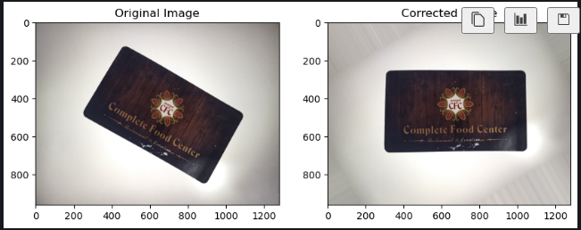

# Image Rotation by Edge Detection

Image rotation functionality with the use of Canny edge Detection with Houghlines 

Fetch the lines coordinates and converting them into degrees with the use of radian.

Create matrics with the use of degress

Perform rotation warpAffine

Displaying the plot

## Here is the Output

,
